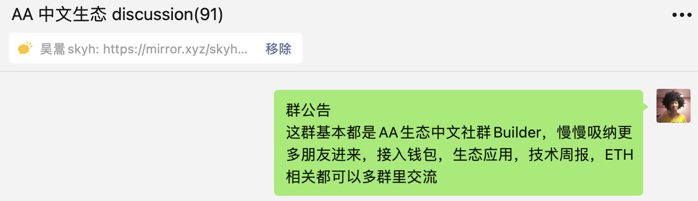
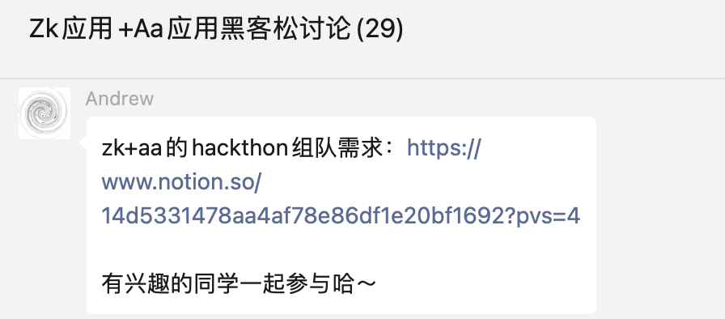

## Example Grant Proposal Outline
### Project Abstract
In 3-5 sentences what problem are you trying to solve? (The project abstract may be used for for the winners announcement.)

我们以开源，社区推动帮助更多的开发者接入AA。我们通过制作更简单易用的SDK，开发者工具，接入教程等方式加强AA生态建设。我们开展AA生态的开发者社区，发布每周周报，协助场景建设，增强开发和用户体验，组队黑客松队伍，让AA生态Dapp丰富起来。


We promote more developers to access Account Abstraction(AA) through open-source and community-driven efforts. We strengthen the AA ecosystem by developing simpler and more user-friendly SDKs, unified API interfaces, developer tools, and integration tutorials. We also establish an AA developer community, release weekly reports, assist in scenario building, enhance development and user experience, and form hackathon teams to enrich the AA ecosystem of Dapps.

### Objectives
What are you hoping to accomplish with this grant? How do you define and measure success for this project?

我们制作通用层AA生态SDK，研究和综合现有SDK特点，成为AA生态底层设施，并且制作一些脚手架快速上手AA。我们协作推进通用的Account EIP标准，让生态钱包打通，我们提供可定制化SDK场景，通过提供一些AA SDK场景化（比如，paymaster，account）教程，帮助开发者快速了解并接入AA钱包。

We are developing a universal AA SDK and researching and integrating the characteristics of existing SDKs to become the underlying infrastructure of the AA ecosystem. We are also creating some scaffolding to quickly get started with AA Dapps. We are collaborating with some DAO members to promote the universal Account EIP standard, enabling Dapps to integrate with all ecosystem wallets. We provide customizable SDK scenarios and offer tutorials on AA SDK scenarios (such as paymaster and account) to help developers quickly understand and integrate with the AA wallet.

### Outcomes
How does this project benefit the greater Ethereum ecosystem?

aa的sdk客户端开发有一定门槛，交易形式有不一致，目前生态应用除了钱包仍然很少，生态隔离。

我们提供类似 ethers.js 公共层统一API，account统一接口，脚手架帮助客户端和移动端快速接入。

我们提供了 AA 生态开发者社区，共享周报最新动态，为社区提供教程和生态布道，让AA生态应用更加丰富。

The development of the AA SDK client has a certain threshold, and the transaction forms are inconsistent. Currently, there are still few ecosystem applications besides the wallet, and the ecosystem is isolated. 

We provide a public layer unified API similar to ethers.js, a unified interface for accounts, and scaffolding to help clients and mobile terminals quickly integrate. 

We have also established an AA ecosystem developer community to share the latest developments and provide tutorials and ecosystem preaching for the community, making AA ecosystem applications more diverse and more secure.

### Grant Scope
What are you going to research? What is the expected output?

首先调研现有 AA SDK 和 已有 ETH 开发者API，综合优势并且推动统一SDK和Account标准。

中文开发者社区的力量，共同研究EIP4337和最新技术，编写使用和场景教程推动AA生态的布道。

协助项目接入AA生态，加强移动和用户体验，建设AA开发者社区，组队参加黑客松应用，丰富AA应用。


Firstly, we conducted research on existing AA SDKs and the existing ETH developer APIs, integrated their advantages, and promoted the unified SDK and Account standards. 

Secondly, we harnessed the power of the Chinese developer community to jointly study EIP4337 and the latest AA technologies, and wrote tutorials on usage and scenarios to promote the preaching of the AA ecosystem, supporting English and Chinese.

Thirdly, we assisted projects in integrating with the AA ecosystem, enhancing mobile dapps and user experience, building an AA developer community, forming teams to participate in hackathons, and enriching AA applications.

The Account.js SDK and related tools may have following features:
1. Connect kit like RainbowKit / ConnectKit, is like the minimal version of [soul-wallet](https://github.com/proofofsoulprotocol/soul-wallet-packages), that will had a beautiful design and great user experience, help developers develop a DAPP with account abstraction connect easily. It also has auth features like
    1. fingerprint authentication
    2. web2 social login
    3. accounts / salts management
    4. compatible with modern wallet connect providers
2. Wallet with plugin system, that can be connect with connect kit, , with features like
    1. session keys
    2. recovery
    3. spending policies
    4. 2fa authentication
3. Relay service kits
    1. a load balancer to bundler API
    2. adapter to gelato / privacy voting or stackup, of the gasless service

### Project Team
How many people are working on this project?

Please list their names and roles for the project as well as how many hours per month will each person work on this project?

Skyhigh 产品，全栈开发，AA生态布道者，全职(120h)，目前负责研究基础设施，场景化研究，AA周报，SDK的设计和编写和测试

Amagi 前端，全栈开发，技术负责，全职(120h)，研究SDK的技术实现，客户端设计，场景实现

Andrew 研究员，zk共学发起人，兼职(40h)，研究AA场景化实现，zk与AA的结合

我们都是中国开发社区的一员，支持DAO包括：Rebase, Plancker, LXDAO, SeeDAO，706青年空间

Skyhigh product and full-stack developer, AA ecosystem evangelist, full-time (120h), currently responsible for researching infrastructure, scenario research, AA Weekly report, SDK design, development and testing.

Amagi, front-end and full-stack developer, technical lead, full-time (120h), researching SDK technical implementation, client design, and scenario implementation.

Andrew, researcher and zk co-learning initiator, part-time (40h), researching AA scenario implementation and the combination of zk and AA.

We are all members of the Chinese developer community and support DAOs including Rebase, Plancker, LXDAO, SeeDAO, and 706 Youth Space.


### Background
Give us a bit of info and include relevant links, if available! Please provide other projects or research papers (ideally public and/or open source), engagements or other types of proof that your team has the necessary experience to undertake the project you are applying for.

Any links for us to review? E.g. research papers, blog posts, etc.


我们是最早帮助SoulWallet制作移动端参与ETHBogota

我们在Rebase社区做过几次EIP4337技术和场景分享和布道

我们跟Plancker社区一起研究Bundler和共学EIP4337

我们制作4337的公共层sdk和工具，让开发者接入，accountjs网址

我们制作了AA的研究和周报：mirror，研究

我们运营了3个月中文生态开发者社区，成员100人


We were the first to help SoulWallet develop a mobile app in ETHBogota. 

We have shared and preached the EIP4337 technology and scenarios several times in the Rebase community. 

We worked with the Plancker community to study Bundler and co-learn EIP4337. 

We created a public SDK and tools for EIP4337, helping developers to integrate.
- https://accountjs.xyz/
- https://github.com/accountjs

We conducted research and produced AA Weekly report on the AA ecosystem
- https://mirror.xyz/skyhighfeng.eth
- https://github.com/accountjs/aa-research

We operated a Chinese ecosystem developer community for three months with 100 members.


 | 
--- | ---

### Methodology
How do you plan to achieve your research objectives?

我们首先结合现有AA SDK优势，制作接入教程和文档，加入到我们脚手架

我们联系社区成员，沟通共同制定AA钱包标准，推动统一钱包体系

我们招募更多志愿AA开发者社区成员贡献，共同开发AA生态应用

 We will leverage the advantages of the existing AA SDK to create integration tutorials and documentation, and add them to our framework. 

 We will also reach out to community members to communicate and jointly develop AA wallet standards, and promote a unified wallet system. 

 Additionally, we will recruit more volunteer AA developers from the community to contribute to the development of the AA ecosystem applications.

### Timeline
Please include a brief explanation on the milestones/roadmap, along with expected deliverables. Also outline how the funds will be used for the research project and or members of the team.

```
4个月
基础研究：
2周：研究现有AA sdk体系，研究了场景，提炼SDK需求（已完成）
2周：开发AA sdk公共版，推动Account统一账户，同时维护文档
产出：AA公共版本，账户EIP推动
应用研究：
4周：开发demo，scaffold，社区交流和协作
4周：共同维护文档，开发教程，黑客松和接入AA应用
产出：DEMO和Scaffold，开发教程文档
布道推广：
4周：共同维护AA社区，增加zk接入和场景，推动社区EIP普及和线下黑客松活动
产出：完善文档，线下活动

```
The Timeline will consist 4 months and 3 milestones: 
1. Milestone: Basic research 
   - 2 weeks: Studied the existing AA SDK system, researched scenarios, and extracted SDK requirements (completed) 
   - 2 weeks: Developed AA SDK public version, proposed unified Account, and maintained documentation 
 - Output: AA public version, Unified Account EIP proposal 
1. Milestone: Application research: 
   - 4 weeks: Developed demo, scaffold, community communication and collaboration 
   - 4 weeks: Maintained documentation, developed tutorials, hackathons and integrated AA applications 
 - Output: DEMO and Scaffold, development tutorial documentation 
1. Milestone: Evangelism and Promotion
   - 4 weeks: Jointly maintained AA community, added zk access and scenarios, improved user experience, promoted community EIP popularization and offline hackathon activities 
 - Output: Improved documentation, activities review.


### Budget
Requested grant amount and how this will be used

Please provide an requested amount and outline of how the grant will be used. A detailed budget proposal would be helpful and some item you could include are:

Principle Researchers Costs
Other Staff Costs
Hardware Costs
Software Costs
Data Collection Costs
Indirect Costs

```
我们团队包括了AA SDK开发和中文社区布道两大任务，已经完成了部分前期工作，所以申请了最高50K：
成员费用：30K
其他成员费用：5K
社区推广和教育：5K
机器费用：3K
软件服务费用：2K
产品合作费用：3K
其他： 2K

Our team includes two major tasks: AA SDK development and Chinese community evangelism. We have already completed some preliminary work, so we are applying for up to 50K:

Member costs: 30K 
Other member costs(eg. design, operation): 5K 
Community promotion and education: 5K 
Machine equipments costs: 3K 
Software service costs: 2K 
Product collaboration costs: 3K 
Others: 2K